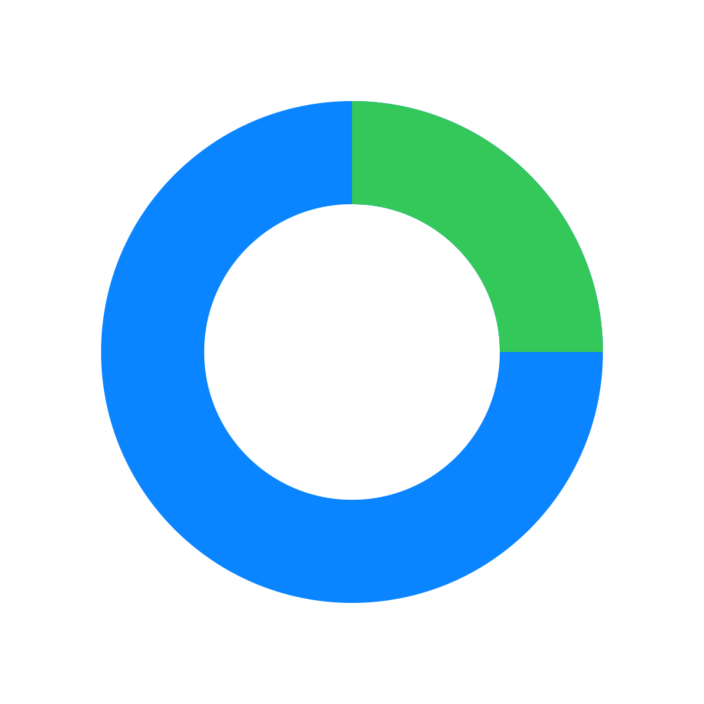

<p align="center">
  
</p>

<h1 align="center">Stocks Pie</h1>

<p align="center">
  A simple pie for money you invest across several brokers.<br />
  <a href="https://steigner.github.io/Stocks-Pie/">Web preview</a> ·
  <a href="https://github.com/Steigner/Stocks-Pie/releases/latest">Download</a>
</p>

Trading 212 has a great feature called a pie. You decide how much of your money
should go where, and every deposit gets split for you.

That works well until you invest with more than one broker. Stocks Pie brings the
same idea to all of them. Add your stocks, ETFs or whole broker accounts, set a
target for each, and type in how much you want to invest. The app tells you how
much to send where.

- **It only buys.** Nothing gets sold. Positions that are ahead just wait for the
  rest to catch up.
- **No tiny orders.** You set a minimum order (5,000 by default), so fees don't
  eat small purchases.
- **Any currency.** Pick the one you use. Nothing gets converted.
- **Your data stays with you.** The desktop app never goes online.

**This is not investment advice.** It's a calculator. Always check your orders
before you place them.

## Download

Want a quick look? Open the [web preview](https://steigner.github.io/Stocks-Pie/).
It runs on sample data and forgets everything when you close it.

For real use, download the desktop app from
[Releases](https://github.com/Steigner/Stocks-Pie/releases/latest). It's available
for Windows, macOS and Linux.

The app isn't code-signed yet, so the first launch needs one extra click:

- **Windows:** click _More info_, then _Run anyway_.
- **macOS:** go to _System Settings → Privacy & Security_ and click _Open Anyway_.

## How a deposit is split

The app only buys positions that are below their target. It splits the money so
your portfolio ends up as close to the targets as possible.

Sometimes a position gets skipped. Say its target is 2.5% and you invest 80,000.
Its share would be 2,000, which is below the 5,000 minimum. Buying 5,000 would
overshoot it, so it waits for the next deposit instead. If your broker has no
minimum fee, set the minimum to 0.

Under the hood it uses water filling and a branch-and-bound search. Tests check
it against a brute-force search on 120 random portfolios.

## Your data

The desktop app has no server, no account and no tracking. Your portfolio is a
single `portfolio.json` file in a folder you pick, and the app can't touch any
other file. The web preview keeps everything in your browser's memory.

Keep in mind that the app doesn't know stock prices. Update your holdings
yourself when the market moves. It also doesn't handle fees or taxes.

## Development

You don't need Node.js. Everything runs in Docker:

```
docker build -t stocks-pie .              # lint, format check, test, and build
docker run --rm -p 4173:4173 stocks-pie   # the preview at http://localhost:4173
```

If you do have Node.js, the npm scripts work as usual. For the desktop app you
also need Rust and the [Tauri prerequisites](https://tauri.app/start/prerequisites/).
Generate the icons once with `npx tauri icon src-tauri/app-icon.svg`, then run
`npm run tauri dev`.

To release, push a tag like `v1.0.0` that matches the version in `package.json`.
GitHub builds the installers into a draft release. Every push to `main` updates
the web preview.

Coding conventions are in [AGENTS.md](AGENTS.md).

## License

_From new era technology for oldschool guys_

[MIT](LICENSE).
